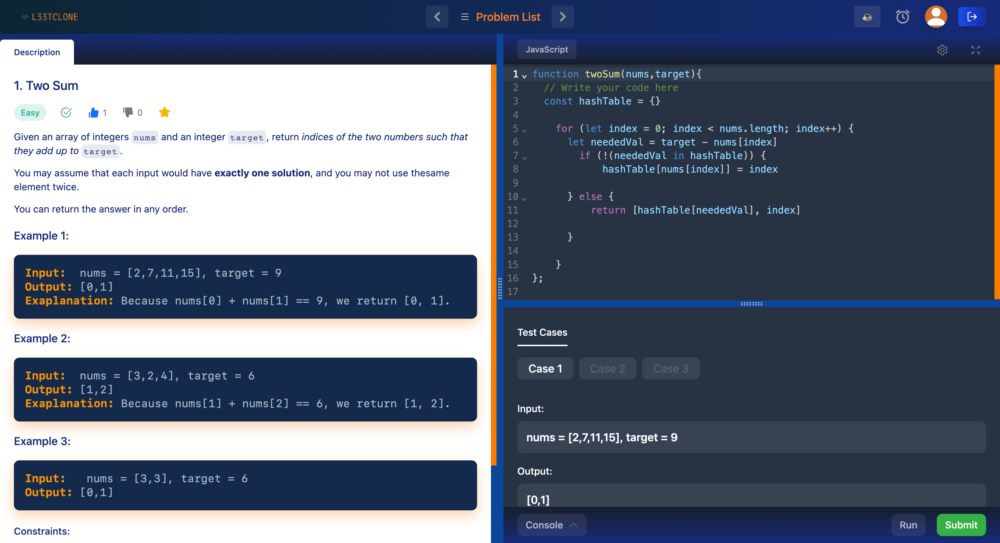

# L33tClone - Online Programming Practice Application



L33tClone is an innovative online platform designed for programming enthusiasts and learners. With L33tClone, you can supercharge your coding skills by tackling a wide range of coding challenges, testing your solutions, and tracking your progress—all in one place.

## Key Features:

- **User Accounts**: Create your personalized account to access a tailored learning experience.

- **Coding Challenges**: Dive into a diverse collection of coding challenges that cover various programming languages and difficulty levels.

- **Code Verification**: Instantly validate your solutions to see if they're correct, helping you learn from your mistakes.

- **Progress Tracking**: Keep tabs on your coding journey with detailed progress metrics and statistics.

- **Save Your Work**: Save and revisit your code solutions, allowing you to build a comprehensive portfolio of your programming accomplishments.

## Installation

To run this project locally, you need to have Node.js and npm (Node Package Manager) installed. If you haven't installed them yet, you can download them from [nodejs.org](https://nodejs.org/).

1. Clone the repository:
``` bash
git clone https://github.com/tolaoyelola/l33tclone.git
```

2. Install the required dependencies:

```bash
cd l33tclone
```
``` bash
npm install
```

3. Set up your database and authentication:

   - Create a Firebase storage(database) on [console.firebase.google.com](https://console.firebase.google.com).
   - Set up a Authentication on your firebase project [console.firebase.google.com](https://console.firebase.google.com) for authentication.
   - Update the configuration files as needed to connect to your Firebase Auth database and Storage.

## Project Details

L33tClone started as a practice project inspired by a YouTube tutorial, which you can watch [here](https://www.youtube.com/watch?v=cSYDnjOTlQk). It serves as an excellent example of how to build an online programming practice platform from scratch.

### Technologies and Dependencies

- **Storage and Authentication**: L33tClone leverages the power of Google Firebase cloud services for data storage and user authentication.

- **NPM Packages**: The project relies on several NPM packages to enhance the user experience and functionality. Some of the key packages include:

  - `"@codemirror/lang-javascript": "^6.2.1"`: Enhancing code editing capabilities.
  - `"@types/node": "18.15.11"`: TypeScript type definitions for Node.js.
  - `"@types/react": "18.0.34"` and `"@types/react-dom": "18.0.11"`: TypeScript type definitions for React.
  - `"@uiw/codemirror-theme-vscode": "^4.21.13"` and `"@uiw/react-codemirror": "^4.21.13"`: Styling and code editing components.
  - `"eslint": "8.38.0"`: Code linting for maintaining code quality.
  - `"firebase": "^9.19.1"`: Firebase SDK for integrating Firebase services.
  - `"next": "13.3.0"`: A popular React framework for building web applications.
  - `"react": "18.2.0"` and `"react-dom": "18.2.0"`: React library and DOM rendering.
  - `"react-confetti": "^6.1.0"`: Adding confetti animations for a fun user experience.
  - `"react-firebase-hooks": "^5.1.1"`: Simplifying the integration of Firebase with React.
  - `"react-icons": "^4.8.0"`: Providing a collection of icons for UI elements.
  - `"react-split": "^2.0.14"`: Enabling resizable split views.
  - `"react-toastify": "^9.1.2"`: Displaying toast notifications.
  - `"react-youtube": "^10.1.0"`: Integrating YouTube videos into the platform.
  - `"recoil": "^0.7.7"`: Managing application-level state in React.
  - `"typescript": "5.0.4"`: A typed superset of JavaScript for enhanced development.

### Coding Challenges

The coding challenges featured in L33tClone draw inspiration from LeetCode, a well-known platform for honing programming skills. These challenges have been manually entered into the Firebase database, enabling users to access and solve a wide variety of problems.

Some of these challenges are closely linked to Firebase, offering a dynamic and interactive learning experience.

## Getting Started

To get started with L33tClone, follow these steps:

1. Clone this repository to your local machine.

2. Install the project dependencies using npm:

   ```bash
   npm install
   ```

3. Set up Firebase configuration by following the instructions in [Firebase documentation](https://firebase.google.com/docs/web/setup).

4. Run the application locally:
   ```bash
   npm run dev
   ```

For more details and updates, please visit the [L33tClone GitHub Repository](https://github.com/tolaoyelola/L33tClone).

Feel free to reach out to at: [tola@ootola.com](mailto:tola@ootola.com) for any inquiries or suggestions.

Feel free to explore the code and adapt it for your own projects or learning purposes.

## Credits

- Tutorial: [Build and Deploy a LeetCode Clone with React: Next JS, TypeScript, Tailwind CSS, Firebase](https://www.youtube.com/watch?v=cSYDnjOTlQk)

##### README created by ChatGPT 🤖

## License

This project is licensed under the [MIT License](LICENSE).

This is a [Next.js](https://nextjs.org/) project bootstrapped with [`create-next-app`](https://github.com/vercel/next.js/tree/canary/packages/create-next-app).

#### Getting Started

First, run the development server:

```bash npm run dev ```

#### or

```bash yarn dev ```

#### or

```bash pnpm dev ```

Open [http://localhost:3000](http://localhost:3000) with your browser to see the result.

You can start editing the pages by modifying the components in the `pages` directory. The page auto-updates as you edit the files.

This project uses [`next/font`](https://nextjs.org/docs/basic-features/font-optimization) to automatically optimize and load fonts.

## Learn More

To learn more about Next.js, take a look at the following resources:

- [Next.js Documentation](https://nextjs.org/docs) - learn about Next.js features and API.
- [Learn Next.js](https://nextjs.org/learn) - an interactive Next.js tutorial.

You can check out [the Next.js GitHub repository](https://github.com/vercel/next.js/) for feedback and contributions.

## Deploy on Vercel

The easiest way to deploy your Next.js app is to use the [Vercel Platform](https://vercel.com/new?utm_medium=default-template&filter=next.js&utm_source=create-next-app&utm_campaign=create-next-app-readme) from the creators of Next.js.

Check out [Next.js deployment documentation](https://nextjs.org/docs/deployment) for more details.
